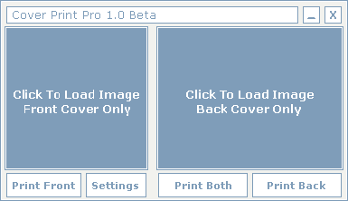



## Cover Print Pro 1\.0

### Description

The Purpose Of This Is To Make It As Simple As Possible To Print Your Cd Covers Realy Good Layout (Graphics Included) If You Want To Carry On this Project Please email Me At i8crowts@hotmail.com

(Only Tested On Windows XP)

Plz Vote As This Is My First App
 
### More Info
 

             |
---                |---
**Submitted On**   |2004-12-04 17:16:06
**By**             |[peter lockwood](https://github.com/Planet-Source-Code/PSCIndex/blob/master/ByAuthor/peter-lockwood.md)
**Level**          |Beginner
**User Rating**    |5.0 (10 globes from 2 users)
**Compatibility**  |VB 6\.0
**Category**       |[Miscellaneous](https://github.com/Planet-Source-Code/PSCIndex/blob/master/ByCategory/miscellaneous__1-1.md)
**World**          |[Visual Basic](https://github.com/Planet-Source-Code/PSCIndex/blob/master/ByWorld/visual-basic.md)
**Archive File**   |[Cover\_Prin1826211262004\.zip](https://github.com/Planet-Source-Code/peter-lockwood-cover-print-pro-1-0__1-57544/archive/master.zip)

